<p align="center"> 


</p>

<p align="center">
   <a> 
</a>
<a>
   
</a>
</p>

___
___

<p align="center">
  <a href="https://educamas.com.co/" target="_blank">
    
  </a>
   <a href="https://simplom.co" target="_blank">
    
  </a> <strong>COHORTE </strong>
  
</p>
<p align="center"> 

</p>

<p align="center"> 

</p>


___

<hr>

<details>
<summary>  LMS VASED </summary>


Andres Esteban Patino

05.05.2022


-->

```
Bienvenido a tu proyecto final de desarrollo web full stack, te felicitamos por haber llegado hasta este punto de tu formación. Sabemos que tienes todas las capacidades para ser un profesional altamente exitoso y por eso te presentamos el último reto académico de Prográmate y Simplon, antes de salir al mundo laboral.   Pertenecerás a un equipo de desarrollo  en el cual deberás desempeñar un role como desarrollador y llegar a la terminación funcional de la aplicación que esté propuesta en el brief de proyecto detallado.  El cual deberá seguir los estándares propuestos detallados en el documento "Guía de competencias a evaluar" y que será desarrollado con el stack MERN. Este será tu proyecto master con el que lograrás corroborar todas las competencias necesarias para certificarte como desarrollador web Full Stack con Prográmate y Simplon.


Marcos de competencias
Desarrollador web y web móvil

Recurso(s)
https://fundacionvased.org/
landing


Contexto del proyecto

La fundación VASED tiene la necesidad de migrar su plataforma hecha en moddle a un desarrollo a medida, por lo que precisa un equipo de desarrollo para poner los cimientos de la nueva plataforma fijando un mínimo producto viable con un mes de plazo.

Requerimientos técnicos.

- La aplicación DEBE tener Login y Registro.
- La aplicación DEBE tener un video de presentación de la plataforma será proporcionado por el stakeholder.
- La aplicación DEBE tener la funcionalidad de recuperar la contraseña.
- La aplicación DEBE tener tres roles de usuario:
- Administrador
- Profesor
- Estudiante
**Administrador:**

- La aplicación DEBE tener un CRUD de usuarios.
- La información que DEBE recoger el CRUD de usuarios es nombre y apellido para el profesor y correo electrónico y nombre, apellido, edad y correo electrónico para los niños.
- La aplicación DEBE tener un CRUD de aulas (Cursos).
- La aplicación DEBE permitir al administrador asignar formadores a las aulas o cursos.
- La aplicación DEBE permitir al administrador asignar los estudiantes a las aulas.
- La aplicación DEBE permitir un máximo de 20 estudiantes por aula.
- La aplicacón DEBE permitir poner un tiempo límite a las aulas o cursos (fecha de finalización del curso).

**Profesor:**

- La aplicación DEBE permitir al profesor crear actividades(Nombre, contexto, fecha de inicio y finalización, recursos).
- La aplicación DEBE permitir al profesor asignar estudiantes a las actividades.
- La aplicación DEBE tener un contador de asistencia de los estudiantes en la plataforma (Tiempo de conexión y hora de ingreso).
- La aplicación DEBE permitir al profesor crear actividades evaluativas(Cuestionarios, tareas).
- La aplicación DEBE permitir tipos de preguntas (Preguntas abiertas, falso y verdadero, preguntas de opción múltiple).
- La aplicación DEBE permitir al profesor ingresar posibles respuestas a las preguntas.
- En el caso de las preguntas abiertas la aplicación DEBE permitir al profesor validar si está bien o no.
- La aplicación DEBE permitir al profesor elegir las respuesta correcta en falso y verdadero.
- La aplicación DEBE permitir al profesor ingresar el valor base sobre el cual se va a calificar.
- La aplicación DEBE permitir al profesor ingresar un valor para cada pregunta.
- La aplicación DEBE tener aulas de inglés que dividan a los estudiantes por los siguientes rangos de edad:
- De 7 a 9 años.
- De 10 a 13 años.
- De 14 a 18 años.

**Estudiante:**

- La aplicación DEBE permitir al estudiante ver las aulas a las que está asignado.
- La aplicación DEBE permitir al estudiante ver las actividades que le corresponden.
- La aplicación DEBE permitir al estudiante realizar las actividades.
- La aplicación DEBE permitir al estudiante ver sus calificaciones.

**Modalidades pedagógicas**

- El desarrollo se hará con un equipo de 7 personas.

- El desarrollo se hará bajo el marco de trabajo SCRUM.

- El desarrollor tendrá 4 sprinst:

- Sprint 1: Del 9 de mayo al 613 de mayo.
- Sprint 2: Del 16 de mayo al 20 de mayo.
- Sprint 3: Del 23 de mayo al 27 de mayo.
- Sprint 4: Del 30 de mayo al 3 de junio.

Criterios de rendimiento

- Se tendrán en cuenta las buenas prácticas en al construcción del product backlog como también el desempeño de los roles dentro del equipo.

- Se tendrá en cuenta la construcción de un buen Readme.
- El proyecto debe estar tal cual lo acordado entre el product owner y el stakeholder.
- El responsive debe estar terminado en su totalidad.

Modalidades de evaluación

- Se hará un sprint review los días 13, 20 y 27 de mayo.
- La aplicación DEBE estar desplegada a partir de la primera sprint review.
- Se debe hacer Daily todos los días y se revisará.

La sprint review tendrá:

- Presentación en diapositivas del proyecto y el progreso hasta el momento.
- Presentación del product backlog hasta ese día.
- Presentación del despliegue o el localhost del proyecto.

Code review.

Entregables

- Repositorio en github.
- Product backlog.
- Sketch o wireframe.
- Mockup.
- UML.
- Modelado de datos.
- Despliegue del proyecto.
- La entrega final será hasta el viernes 3 de junio a las 23:59.

```
</details>


<hr>

---


___
---

 **LMS API:**

---
---

<table BORDER=5 >

  <tr  >
    <th COLSPAN=8 >Auth</th>     
  </tr>
  <tr style="background-color:purple">
  <td></td>
    <td>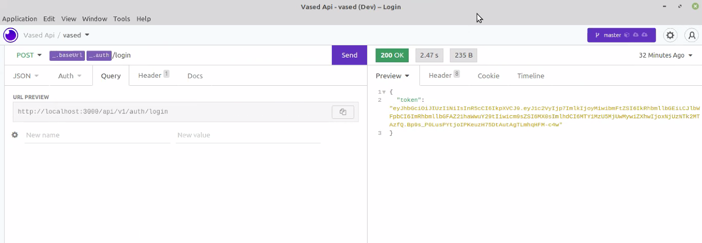  </td>
    <td>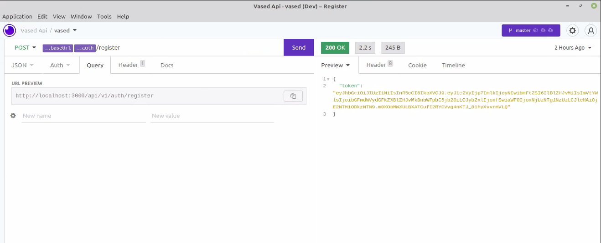</td>
    <td>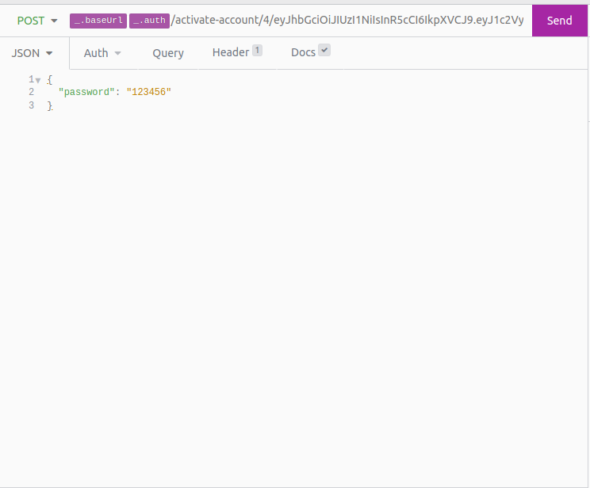  </td>
    <td>  </td>
     <td>  </td>
     <td></td><td></td>
  </tr>
   
   <tr aling="center">
     
   <th COLSPAN=8 > User </th>
   
  </tr>
  <tr style="background-color:purple">
   <td></td>
    <td>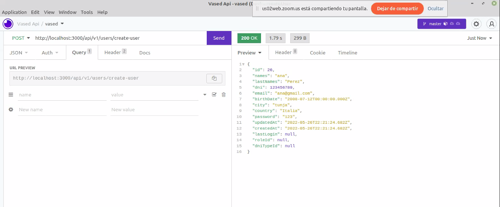  </td>
    <td>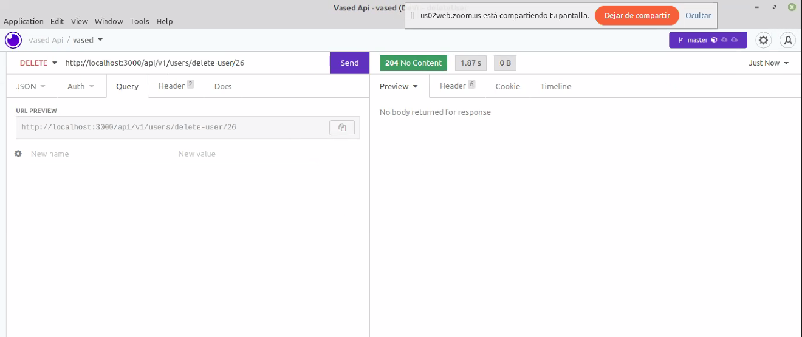</td>
    <td>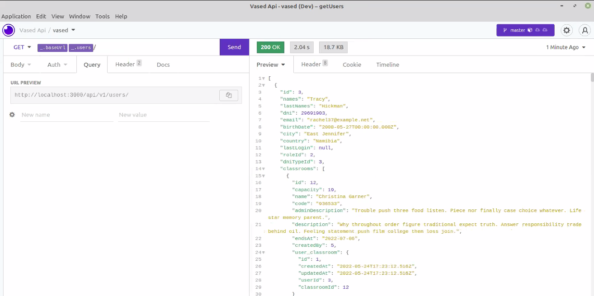</td>
    <td>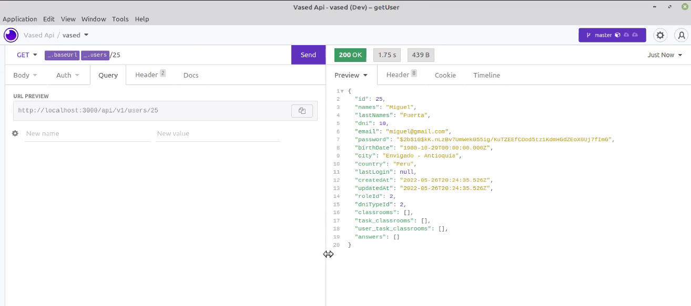</td>
    <td>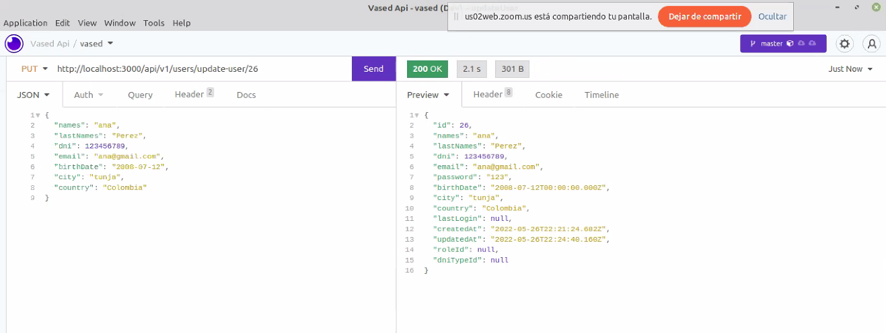</td>
     <td></td><td></td>
  </tr>
  
  

 <tr>
     
   <th COLSPAN=8> Classroms </th>
   
  </tr>
  <tr style="background-color:purple">
    <td>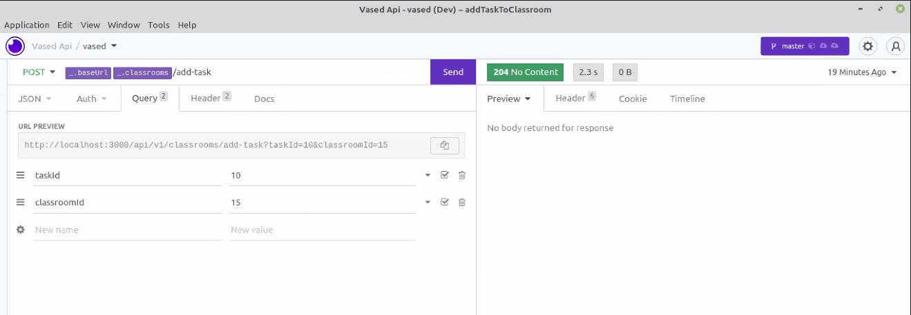  </td>
    <td>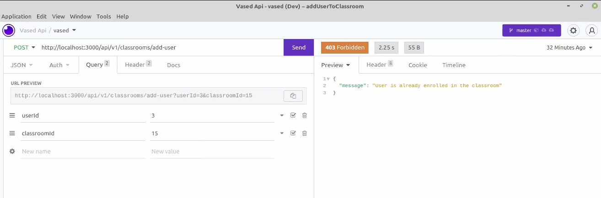</td>
    <td>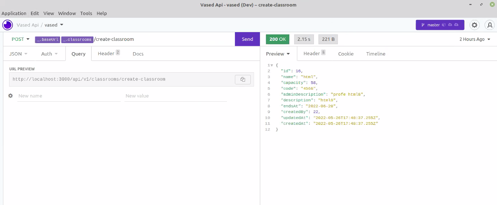</td>
    <td>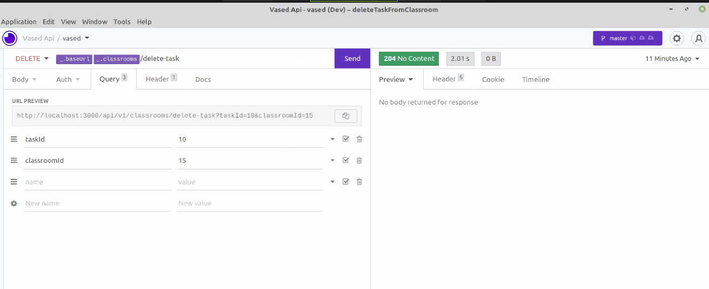</td>
    <td>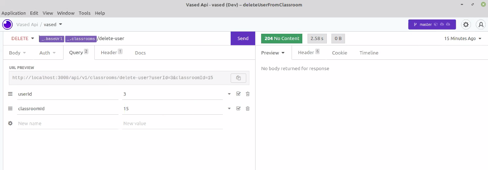</td>
    <td>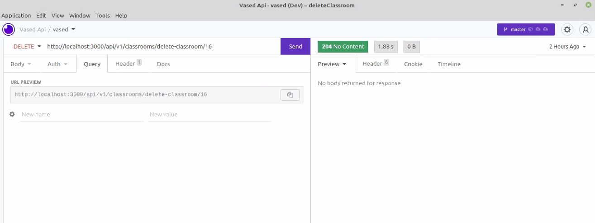</td>
    <td>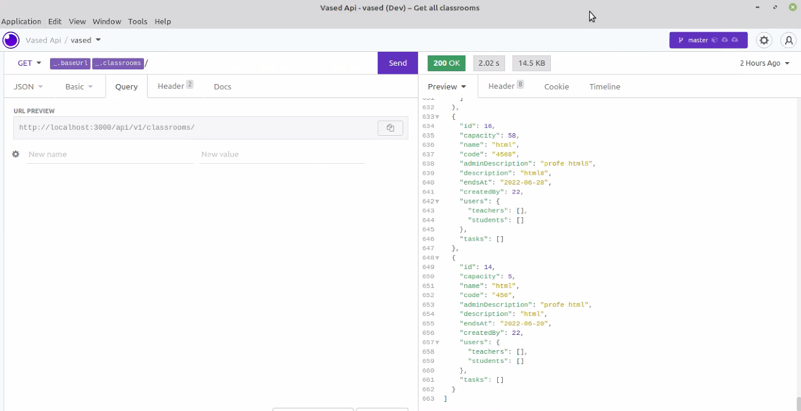</td>
    <td>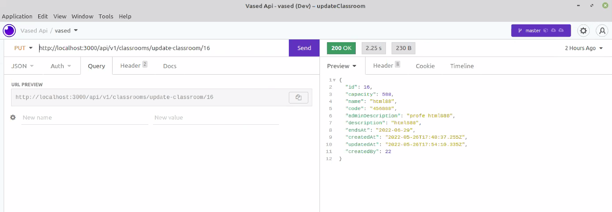</td>
  </tr> 

  <th COLSPAN=8> Task </th>
   
  </tr>
  <tr style="background-color:purple">
    <td></td>
    <td>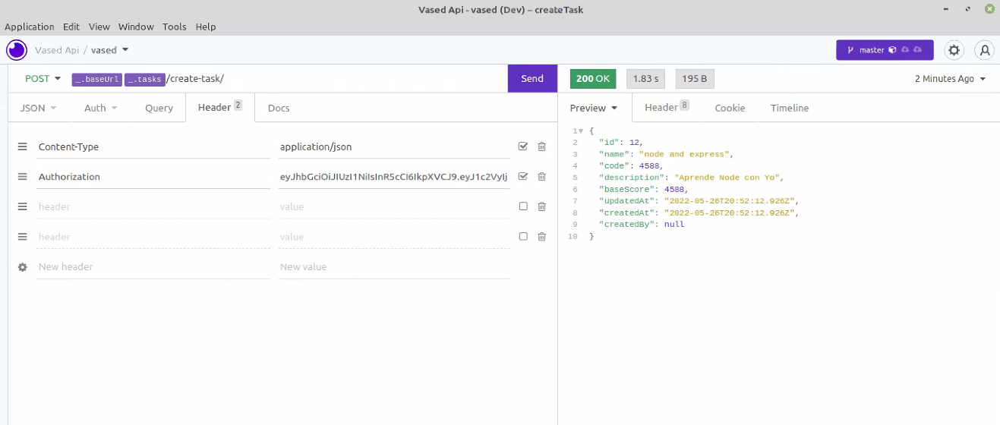  </td>
    <td>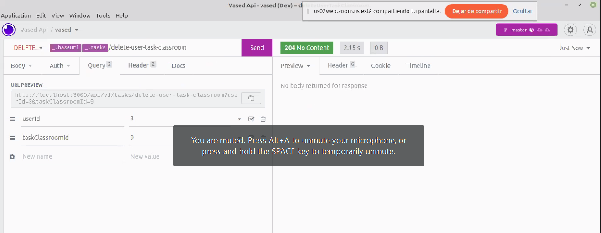</td>
    <td>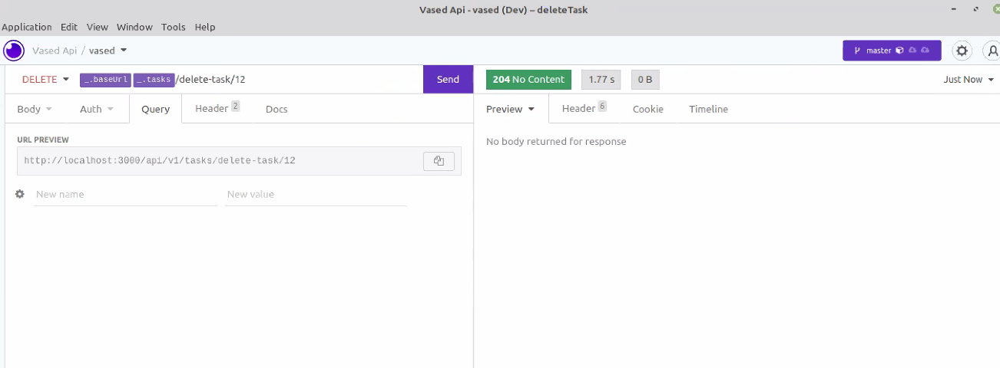</td>
    <td>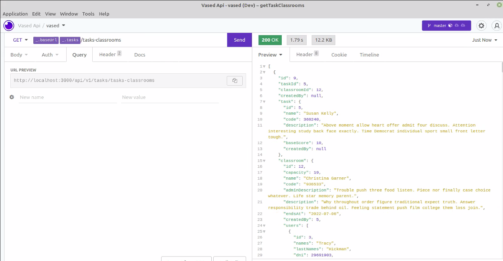</td>
    <td>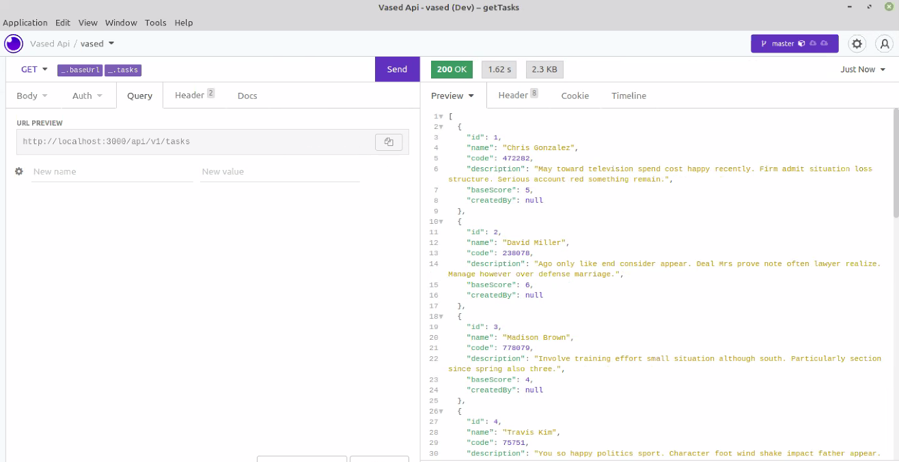</td>
    <td>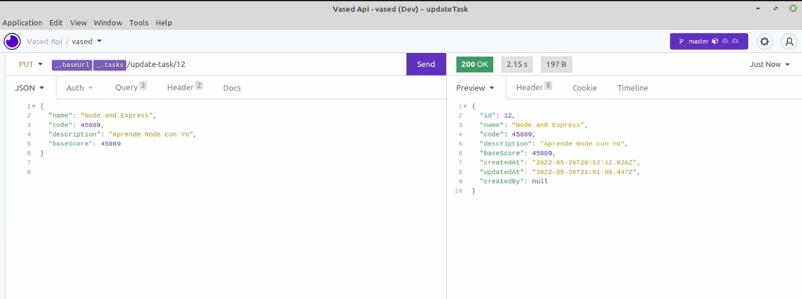</td>
    <td>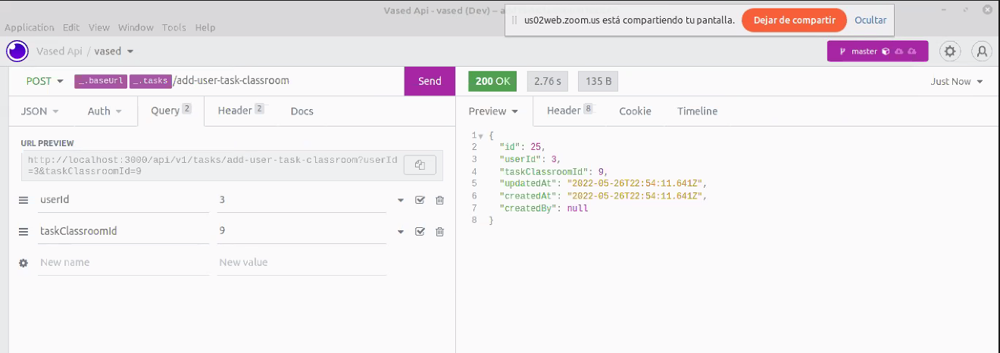</td>
   
  </tr>   

   <th COLSPAN=8> Utils </th>
   
  </tr>
  <tr style="background-color:purple">
    <td></td><td></td>
    <td></td>
    <td>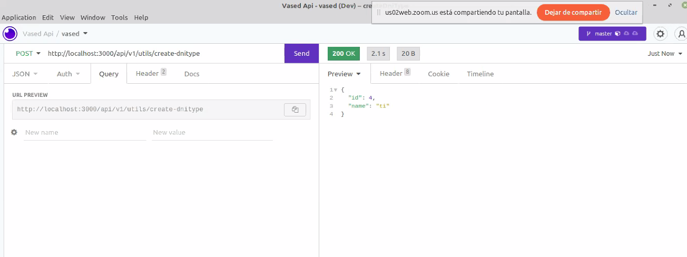  </td>
    <td>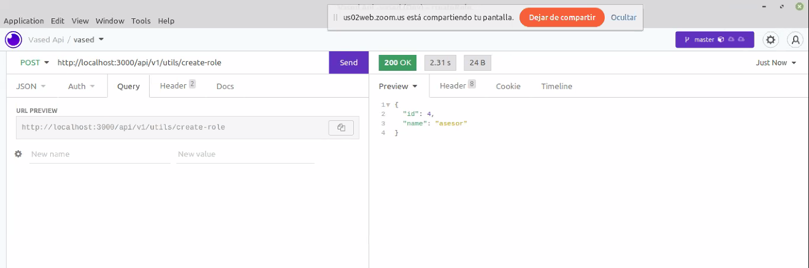</td>
    <td></td>
    <td></td> <td></td>
   
  </tr>   


 </table>

---
---

**Documents insomia api**

---

[Link Insomia api pdf](docs/pdf/insomia_pdf.pdf "insomia pdf")

---

[Link Insomia yaml](docs/insomia/Insomnia_api_2022-06-02.yaml "insomia yaml" )

---

[Link Insomia json](docs/insomia/Insomnia_api_2022-06-02.json "insomia json")

---
---

**Document schema bd progresql**

---

[Link schema bd vased](https://schemavaseddb.dariohimo.repl.co/ "bd vased schema")

---

[Link diagram bd vased](https://drawsql.app/freedom-developers/diagrams/vased-db)

---
---

**Structure directory project**

---

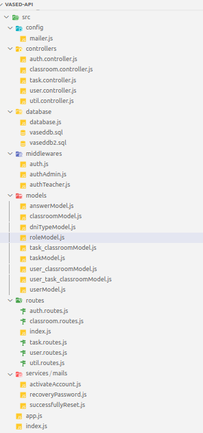


---
---

**NodeJs:**

<hr>


```nodejs
    Technologies nodejs:

    "bcrypt": "^5.0.1",
    "cors": "^2.8.5",
    "dotenv": "^16.0.1",
    "express": "^4.18.1",
    "jsonwebtoken": "^8.5.1",
    "morgan": "^1.10.0",
    "pg": "^8.7.3",
    "pg-hstore": "^2.3.4",
    "sequelize": "^6.19.0"
 ```   
---

**Clone repo:**

---

```git


Clone repo

git clone https://github.com/dariohimo//vased-api

npm install
npm run 

install postgresql
created name bd

install DBeaver connect to bd


```


---
---
---

<p align="center">
  <a href="https://skillicons.dev">
    
  </a>
</p>

<hr>
<hr>


### <summary style="color: green" align="center" > links project <strong> LMS VASED </strong> </summary>

---
<strong> Backlog</strong>

---

[Link Backlog **LMS VASED** ](https://trello.com/invite/b/8cHlr6ae/73702569ba5328facf44e6d7200db746/backlog  "Backlog Trello")

---

<strong style="color: green"> Repository </strong>

---

[GitHub **LMS VASED Backend** ](https://github.com/dariohimo//vased-api " Repo Backend")

---

[GitHub **LMS VASED Fronted** ](https://github.com/Jhuset2003/VasedWeb " Repo Fronted")

---

---

<summary style="color: green" > Deploy Backend </summary>

---

[ **Deploy Heroku** LMS Vased](https://vased-api.herokuapp.com/api/v1/ "Deploy BACKEND")

---

---

<summary style="color: green" > Deploy Fronted </summary>

---

[ **Deploy Vercel** Vased LMS ]( https://vased-web.vercel.app "Deploy FRONTED")

---
___

***
<p align="center"> 

</p>

### <p align="center">  Coder Project Educamas </p>

<p align="center"> 

</p>

___


**github** :octocat:
___
---


<p align="center"> 

</p>


- 👩‍💻 **[Daniela Puerta Castrillón]( https://github.com/daniela8896)**
- 👩‍💻 **[Sara Salas]( https://github.com/sarisp3260 )**
- 👩‍💻 **[Christian Javier Ruiz]( https://github.com/Lord-Mugen )**
- 👩‍💻 **[Miguel Cuello]( https://github.com/migcm06)**
- 👩‍💻 **[Emmanuel Estupiñan]( https://github.com/emmanueles1993 )**
- 👨‍💻 **[Albert Quintanilla]( https://github.com/Jhuset2003)**
- 👨‍💻 **[Enmanuel Pereira]( https://github.com/iElectro13)**
- 👨‍💻 **[Dario Higuera Moreno]( https://github.com/dariohimo)**
___
---

<p align="center"> Cohorte No.4 Proyecto Final << Junio 3 de 2022 >> </p>

<p align="center"> 

</p>


---
